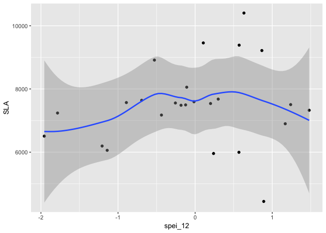
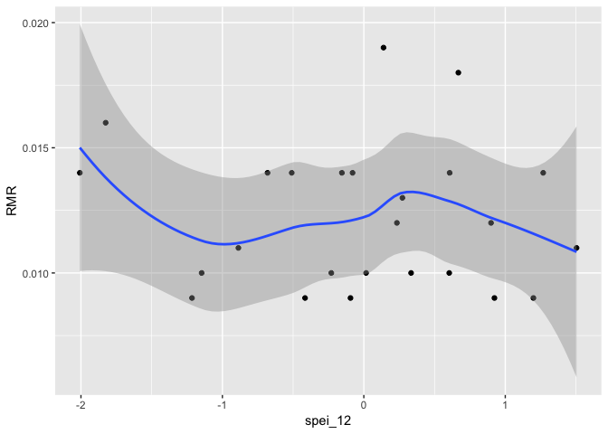
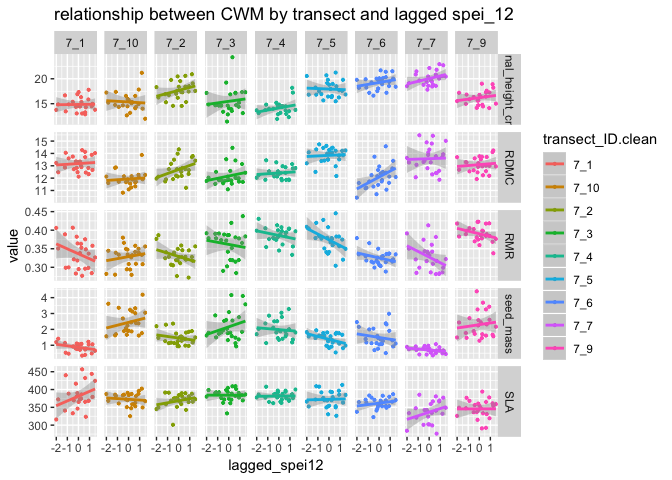

Kelman Preliminary Results
================
ek, jl, cw
Feb 25 2019

script purpose: feed in CWM and CWV outputs to create figures and models for analyses

SETUP

``` r
rm(list=ls()) # start with clean environment
options(stringsAsFactors = FALSE) #character variables never factor by default 
```

Load libraries

``` r
library(tidyverse)
library(ggplot2)

#set relative pathway to Google Drive --> user will need to adjust this <---
# **uncomment whichever path is yours when running script
gdrive <- "/Users/emilykelman/Google\ Drive" #emily's path
#gdrive <- "../../../Google\ Drive" #ctw path
#gdrive <- "" #julie's path
```

read in data

``` r
CWV <- read.csv(paste0(gdrive, "/KelmanProject/Data/CWV_climate_merge.csv"))
CWM_regressions <- read.csv(paste0(gdrive, "/KelmanProject/Data/CWM_for_regressions.csv"))
CWM_figures <- read.csv(paste0(gdrive, "/KelmanProject/Data/CWM_for_figures.csv"))
```

=====create CWV figures and run linear regressions (current)====== plot trait/spei\_12 relationship using pooled data run lm

``` r
#plot CWV SLA and spei_12. continue for all traits
CWV_SLA_spei_fig<-ggplot(CWV, mapping = aes(x=spei_12, y=SLA))+
  geom_point()+
  geom_smooth()

CWV_SLA_spei_fig
```

    ## `geom_smooth()` using method = 'loess' and formula 'y ~ x'



``` r
#run linear model for CWV SLA and spei_12
#pvalue .4 r^2 -.01
#not significant 
CWV_SLA_spei_LM <- lm(formula = SLA ~ spei_12, data=CWV)
summary(CWV_SLA_spei_LM)
```

    ## 
    ## Call:
    ## lm(formula = SLA ~ spei_12, data = CWV)
    ## 
    ## Residuals:
    ##     Min      1Q  Median      3Q     Max 
    ## -3268.6  -537.2    25.6   302.2  2753.9 
    ## 
    ## Coefficients:
    ##             Estimate Std. Error t value Pr(>|t|)    
    ## (Intercept)   7502.4      262.1  28.623   <2e-16 ***
    ## spei_12        233.7      296.6   0.788    0.439    
    ## ---
    ## Signif. codes:  0 '***' 0.001 '**' 0.01 '*' 0.05 '.' 0.1 ' ' 1
    ## 
    ## Residual standard error: 1309 on 23 degrees of freedom
    ## Multiple R-squared:  0.02627,    Adjusted R-squared:  -0.01606 
    ## F-statistic: 0.6206 on 1 and 23 DF,  p-value: 0.4389

``` r
#plot CWV RMR and spei_12
CWV_RMR_spei_fig <- ggplot(CWV, mapping = aes(x=spei_12, y=RMR))+
  geom_point()+
  geom_smooth()

CWV_RMR_spei_fig
```

    ## `geom_smooth()` using method = 'loess' and formula 'y ~ x'



``` r
#run linear regression for CWV RMR and spei_12
#p value .6 and r^2 -.03
#not significant
CWV_RMR_spei_LM<- lm(formula = RMR ~ spei_12, data = CWV)
summary(CWV_RMR_spei_LM)
```

    ## 
    ## Call:
    ## lm(formula = RMR ~ spei_12, data = CWV)
    ## 
    ## Residuals:
    ##        Min         1Q     Median         3Q        Max 
    ## -0.0035490 -0.0022640 -0.0001273  0.0017580  0.0068446 
    ## 
    ## Coefficients:
    ##               Estimate Std. Error t value Pr(>|t|)    
    ## (Intercept)  0.0121871  0.0005819  20.943   <2e-16 ***
    ## spei_12     -0.0002999  0.0006586  -0.455    0.653    
    ## ---
    ## Signif. codes:  0 '***' 0.001 '**' 0.01 '*' 0.05 '.' 0.1 ' ' 1
    ## 
    ## Residual standard error: 0.002906 on 23 degrees of freedom
    ## Multiple R-squared:  0.008935,   Adjusted R-squared:  -0.03415 
    ## F-statistic: 0.2074 on 1 and 23 DF,  p-value: 0.6531

=====create CWM figures===== panel plot of CWMs, spei\_12 on x, trait on y transect level fig 1: current spei\_12 fig 2: lagged spei\_12

``` r
#issue: trying to figure out how to show spei_12 on x-axis 
fig1 <- ggplot(subset( CWM_figures, trait_name%in% c("final_height_cm", "RMR", "SLA", "RDMC", "seed_mass")), mapping = aes(x=trait_name %in% "spei_12", y="value"))+
  geom_point(aes(col = transect_ID), size = 0.5)+
  facet_grid(trait_name~., scales = "free_y")

fig1
```



``` r
  #'
CWV$spei_lag <- lag(CWV$spei_12, k=1)
```
