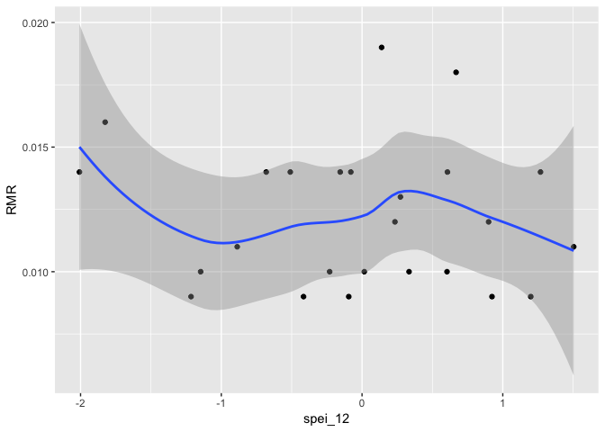
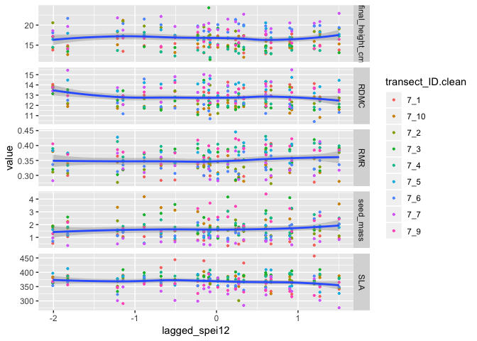
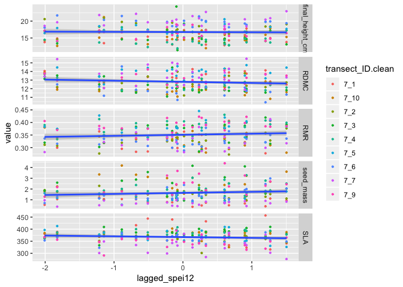

Kelman Preliminary Results
================
ek, jl, cw
Feb 25 2019

script purpose: feed in CWM and CWV outputs to create figures and models for analyses

SETUP

``` r
rm(list=ls()) # start with clean environment
options(stringsAsFactors = FALSE) #character variables never factor by default 
```

Load libraries

``` r
library(tidyverse) #tidyverse has ggplot2, no need to load separately


#set relative pathway to Google Drive --> user will need to adjust this <---
# **uncomment whichever path is yours when running script
gdrive <- "/Users/emilykelman/Google\ Drive" #emily's path
#gdrive <- "/Users/serahsierra/Google\ Drive" #ctw path
#gdrive <- "" #julie's path
```

read in data

``` r
CWV <- read.csv(paste0(gdrive, "/KelmanProject/Data/CWV_climate_merge.csv"))
tranCWM_regressions <- read.csv(paste0(gdrive, "/KelmanProject/Data/transectCWM_for_regressions.csv"))
tranCWM_figures <- read.csv(paste0(gdrive, "/KelmanProject/Data/transectCWM_for_figures.csv"))
poolCWM_regressions <- read.csv(paste0(gdrive, "/KelmanProject/Data/pooledCWM_for_figures.csv"))
poolCWM_figures <- read.csv(paste0(gdrive, "/KelmanProject/Data/pooledCWM_for_figures.csv"))
clim_dat <- read.csv(paste0(gdrive, "/KelmanProject/Data/boulder_climate.csv"))
```

add lagged spei\_12 to tranCWM\_figures DF & CWV DF

create vector

``` r
CWV$spei_lag <- lag(CWV$spei_12, k=1)
```

add to DF

``` r
tranCWM_figures$lagged_spei12 <- CWV$spei_lag
CWV$lagged_spei12 <- CWV$spei_lag
```

=====create CWV figures (current and lagged)======

fig 1: variation in trait values (CWV) in relation to current spei\_12 (pooled data)

fig 2: variation in trait values (CWV) in relation to lagged spei\_12 (pooled data)

``` r
#plot fig 1: panel plot of CWV of traits and current spei_12
```

``` r
#need to re organize or create CWV for figures DF to put traits in same column 
```

====exploratory CWV figures======

``` r
#plot CWV RMR and spei_12
CWV_RMR_spei_fig <- ggplot(CWV, mapping = aes(x=spei_12, y=RMR))+
  geom_point()+
  geom_smooth(method=lm)

CWV_RMR_spei_fig
```



====run linear regressions for CWV and traits (current)=====

``` r
#LM of CWV RMR and spei_12
#p value .6 and r^2 -.03
#not significant
current_CWV_RMR_spei_LM<- lm(formula = RMR ~ spei_12, data = CWV)
summary(current_CWV_RMR_spei_LM)
```

    ## 
    ## Call:
    ## lm(formula = RMR ~ spei_12, data = CWV)
    ## 
    ## Residuals:
    ##       Min        1Q    Median        3Q       Max 
    ## -0.003552 -0.002261 -0.000124  0.001761  0.006848 
    ## 
    ## Coefficients:
    ##               Estimate Std. Error t value Pr(>|t|)    
    ## (Intercept)  0.0121931  0.0005814  20.973   <2e-16 ***
    ## spei_12     -0.0002956  0.0006446  -0.459    0.651    
    ## ---
    ## Signif. codes:  0 '***' 0.001 '**' 0.01 '*' 0.05 '.' 0.1 ' ' 1
    ## 
    ## Residual standard error: 0.002906 on 23 degrees of freedom
    ## Multiple R-squared:  0.009063,   Adjusted R-squared:  -0.03402 
    ## F-statistic: 0.2104 on 1 and 23 DF,  p-value: 0.6508

``` r
#LM of CWV final height and spei_12
#p value .002 r^2 .2951
#significant!
current_CWV_height_spei_LM <- lm(formula = height ~ spei_12, data = CWV)
summary(current_CWV_height_spei_LM)
```

    ## 
    ## Call:
    ## lm(formula = height ~ spei_12, data = CWV)
    ## 
    ## Residuals:
    ##      Min       1Q   Median       3Q      Max 
    ## -10.8567  -2.6228  -0.4029   0.6412  15.3170 
    ## 
    ## Coefficients:
    ##             Estimate Std. Error t value Pr(>|t|)    
    ## (Intercept)   38.792      1.220  31.807  < 2e-16 ***
    ## spei_12        4.494      1.352   3.324  0.00296 ** 
    ## ---
    ## Signif. codes:  0 '***' 0.001 '**' 0.01 '*' 0.05 '.' 0.1 ' ' 1
    ## 
    ## Residual standard error: 6.096 on 23 degrees of freedom
    ## Multiple R-squared:  0.3245, Adjusted R-squared:  0.2951 
    ## F-statistic: 11.05 on 1 and 23 DF,  p-value: 0.002957

``` r
#LM CWV RDMC and spei_12
#p alue .19 r^2 .031
#not significant
current_CWV_RDMC_spei_LM <- lm(formula = RDMC ~ spei_12, data = CWV)
summary(current_CWV_RDMC_spei_LM)
```

    ## 
    ## Call:
    ## lm(formula = RDMC ~ spei_12, data = CWV)
    ## 
    ## Residuals:
    ##      Min       1Q   Median       3Q      Max 
    ## -1.82572 -0.79366  0.05523  0.55516  2.99287 
    ## 
    ## Coefficients:
    ##             Estimate Std. Error t value Pr(>|t|)    
    ## (Intercept)   6.2414     0.2284   27.32   <2e-16 ***
    ## spei_12       0.3368     0.2532    1.33    0.197    
    ## ---
    ## Signif. codes:  0 '***' 0.001 '**' 0.01 '*' 0.05 '.' 0.1 ' ' 1
    ## 
    ## Residual standard error: 1.142 on 23 degrees of freedom
    ## Multiple R-squared:  0.07141,    Adjusted R-squared:  0.03104 
    ## F-statistic: 1.769 on 1 and 23 DF,  p-value: 0.1966

``` r
#LM CWV seed mass and spei_12
#p value .449 r^2 -.017
#not significant
current_CWV_seedmass_spei_LM <- lm(formula = seedmass ~ spei_12, data = CWV)
summary(current_CWV_seedmass_spei_LM)
```

    ## 
    ## Call:
    ## lm(formula = seedmass ~ spei_12, data = CWV)
    ## 
    ## Residuals:
    ##     Min      1Q  Median      3Q     Max 
    ## -6.0179 -1.8908  0.1912  1.8418  6.9771 
    ## 
    ## Coefficients:
    ##             Estimate Std. Error t value Pr(>|t|)    
    ## (Intercept)   8.5112     0.5965   14.27 6.49e-13 ***
    ## spei_12      -0.5094     0.6614   -0.77    0.449    
    ## ---
    ## Signif. codes:  0 '***' 0.001 '**' 0.01 '*' 0.05 '.' 0.1 ' ' 1
    ## 
    ## Residual standard error: 2.982 on 23 degrees of freedom
    ## Multiple R-squared:  0.02514,    Adjusted R-squared:  -0.01724 
    ## F-statistic: 0.5933 on 1 and 23 DF,  p-value: 0.449

``` r
#LM CWV SLA and spei_12
#p value .42 r^2 -.014
current_CWV_SLA_spei_LM <- lm(formula = SLA ~ spei_12, data = CWV)
summary(current_CWV_SLA_spei_LM)
```

    ## 
    ## Call:
    ## lm(formula = SLA ~ spei_12, data = CWV)
    ## 
    ## Residuals:
    ##     Min      1Q  Median      3Q     Max 
    ## -3271.8  -522.9    23.7   303.7  2750.2 
    ## 
    ## Coefficients:
    ##             Estimate Std. Error t value Pr(>|t|)    
    ## (Intercept)   7497.8      261.7  28.647   <2e-16 ***
    ## spei_12        233.6      290.2   0.805    0.429    
    ## ---
    ## Signif. codes:  0 '***' 0.001 '**' 0.01 '*' 0.05 '.' 0.1 ' ' 1
    ## 
    ## Residual standard error: 1308 on 23 degrees of freedom
    ## Multiple R-squared:  0.0274, Adjusted R-squared:  -0.01489 
    ## F-statistic: 0.6479 on 1 and 23 DF,  p-value: 0.4291

====run linear regressions for CWV and traits (lagged)=====

``` r
#LM of CWV RMR and lagged spei
#p value .02 r^2 .1624
#significant! 
lag_CWV_RMR_spei_LM <- lm(formula = RMR ~ lagged_spei12, data = CWV)
summary(lag_CWV_RMR_spei_LM)
```

    ## 
    ## Call:
    ## lm(formula = RMR ~ lagged_spei12, data = CWV)
    ## 
    ## Residuals:
    ##        Min         1Q     Median         3Q        Max 
    ## -0.0042164 -0.0018309 -0.0004392  0.0020520  0.0060182 
    ## 
    ## Coefficients:
    ##                 Estimate Std. Error t value Pr(>|t|)    
    ## (Intercept)    0.0122823  0.0005383  22.817   <2e-16 ***
    ## lagged_spei12 -0.0013722  0.0005873  -2.337    0.029 *  
    ## ---
    ## Signif. codes:  0 '***' 0.001 '**' 0.01 '*' 0.05 '.' 0.1 ' ' 1
    ## 
    ## Residual standard error: 0.002637 on 22 degrees of freedom
    ##   (1 observation deleted due to missingness)
    ## Multiple R-squared:  0.1988, Adjusted R-squared:  0.1624 
    ## F-statistic: 5.459 on 1 and 22 DF,  p-value: 0.02897

``` r
#LM of CWV final height and lagged spei
#p value .89 r^2 -.044
#not significant
lag_CWV_height_spei_LM <- lm(formula = height ~ lagged_spei12, data = CWV)
summary(lag_CWV_height_spei_LM)
```

    ## 
    ## Call:
    ## lm(formula = height ~ lagged_spei12, data = CWV)
    ## 
    ## Residuals:
    ##      Min       1Q   Median       3Q      Max 
    ## -10.9013  -5.8633  -0.0114   3.4084  18.7203 
    ## 
    ## Coefficients:
    ##               Estimate Std. Error t value Pr(>|t|)    
    ## (Intercept)    38.7508     1.5460  25.065   <2e-16 ***
    ## lagged_spei12   0.2181     1.6866   0.129    0.898    
    ## ---
    ## Signif. codes:  0 '***' 0.001 '**' 0.01 '*' 0.05 '.' 0.1 ' ' 1
    ## 
    ## Residual standard error: 7.574 on 22 degrees of freedom
    ##   (1 observation deleted due to missingness)
    ## Multiple R-squared:  0.0007597,  Adjusted R-squared:  -0.04466 
    ## F-statistic: 0.01673 on 1 and 22 DF,  p-value: 0.8983

``` r
#LM of CWV RDMC and lagged spei
#p value .15 r^2 .04
#not significant
lag_CWV_RDMC_spei_LM <- lm(formula = RDMC ~ lagged_spei12, data = CWV)
summary(lag_CWV_RDMC_spei_LM)
```

    ## 
    ## Call:
    ## lm(formula = RDMC ~ lagged_spei12, data = CWV)
    ## 
    ## Residuals:
    ##     Min      1Q  Median      3Q     Max 
    ## -1.8672 -1.1338  0.2425  0.5916  2.3623 
    ## 
    ## Coefficients:
    ##               Estimate Std. Error t value Pr(>|t|)    
    ## (Intercept)     6.2333     0.2359  26.428   <2e-16 ***
    ## lagged_spei12   0.3800     0.2573   1.477    0.154    
    ## ---
    ## Signif. codes:  0 '***' 0.001 '**' 0.01 '*' 0.05 '.' 0.1 ' ' 1
    ## 
    ## Residual standard error: 1.155 on 22 degrees of freedom
    ##   (1 observation deleted due to missingness)
    ## Multiple R-squared:  0.09018,    Adjusted R-squared:  0.04883 
    ## F-statistic: 2.181 on 1 and 22 DF,  p-value: 0.1539

``` r
#LM of CWV seedmass and lagged spei
#p value .73 r^2 -.04
#not significant
lag_CWV_seedmass_spei_LM <-lm(formula = seedmass ~ lagged_spei12, data = CWV)
summary(lag_CWV_seedmass_spei_LM)
```

    ## 
    ## Call:
    ## lm(formula = seedmass ~ lagged_spei12, data = CWV)
    ## 
    ## Residuals:
    ##     Min      1Q  Median      3Q     Max 
    ## -6.1168 -1.7664  0.2346  1.5664  7.1873 
    ## 
    ## Coefficients:
    ##               Estimate Std. Error t value Pr(>|t|)    
    ## (Intercept)     8.5452     0.6283  13.601 3.46e-12 ***
    ## lagged_spei12   0.2307     0.6854   0.337     0.74    
    ## ---
    ## Signif. codes:  0 '***' 0.001 '**' 0.01 '*' 0.05 '.' 0.1 ' ' 1
    ## 
    ## Residual standard error: 3.078 on 22 degrees of freedom
    ##   (1 observation deleted due to missingness)
    ## Multiple R-squared:  0.005125,   Adjusted R-squared:  -0.0401 
    ## F-statistic: 0.1133 on 1 and 22 DF,  p-value: 0.7396

``` r
#LM of CWV SLA and lagged spei
#p value .159 r^2 .04
#not significant
lag_CWV_SLA_spei_LM <- lm(formula = SLA ~ lagged_spei12, data = CWV)
summary(lag_CWV_SLA_spei_LM)
```

    ## 
    ## Call:
    ## lm(formula = SLA ~ lagged_spei12, data = CWV)
    ## 
    ## Residuals:
    ##      Min       1Q   Median       3Q      Max 
    ## -2511.28  -864.76    24.63   721.13  2182.35 
    ## 
    ## Coefficients:
    ##               Estimate Std. Error t value Pr(>|t|)    
    ## (Intercept)     7485.2      264.4  28.310   <2e-16 ***
    ## lagged_spei12   -419.8      288.4  -1.455     0.16    
    ## ---
    ## Signif. codes:  0 '***' 0.001 '**' 0.01 '*' 0.05 '.' 0.1 ' ' 1
    ## 
    ## Residual standard error: 1295 on 22 degrees of freedom
    ##   (1 observation deleted due to missingness)
    ## Multiple R-squared:  0.08781,    Adjusted R-squared:  0.04634 
    ## F-statistic: 2.118 on 1 and 22 DF,  p-value: 0.1597

=====create CWM figures=====

panel plot of CWMs, spei\_12 on x, trait on y

transect level

fig 3: current spei\_12

fig 4: lagged spei\_12

``` r
#issue: trying to figure out how to show spei_12 on x-axis 
# **solution: need to have climate data in their own column if want to use on the x-axis, so just merge climate data with long-form trait value
# ** it's okay that climate data are both in the trait_name column, and in their own column. 
# ** it's more columns in the data frame, but also makes the data frame flexible so you can plot however you like
tranCWM_figures <- left_join(tranCWM_figures, clim_dat, by = c("Year" = "year"))

#plot fig 3: panel plot of CWM traits at transect level with current spei_12 on x
current_tranCWM_spei_panel <- ggplot(subset(tranCWM_figures, trait_name%in% c("final_height_cm", "RMR", "SLA", "RDMC", "seed_mass")), 
               mapping = aes(x=spei_12, y=value))+
  geom_point(aes(col = transect_ID.clean), size = 0.75)+
  geom_smooth(method=lm)+
  facet_grid(trait_name~., scales = "free_y")+
  ggtitle("Relationship between Transect level CWM and spei_12")

current_tranCWM_spei_panel
```



run linear regression with multiple trait variables (current)

pvalue .57 r^2 -.003

``` r
current_tranCWM_spei_LM <- lm(formula = SLA + final_height_cm + seed_mass + RDMC + RMR ~ spei_12, data=tranCWM_regressions)
summary(current_tranCWM_spei_LM)
```

    ## 
    ## Call:
    ## lm(formula = SLA + final_height_cm + seed_mass + RDMC + RMR ~ 
    ##     spei_12, data = tranCWM_regressions)
    ## 
    ## Residuals:
    ##     Min      1Q  Median      3Q     Max 
    ## -86.659 -14.169   3.514  17.031  87.590 
    ## 
    ## Coefficients:
    ##             Estimate Std. Error t value Pr(>|t|)    
    ## (Intercept)  398.755      1.844 216.289   <2e-16 ***
    ## spei_12       -1.141      2.034  -0.561    0.576    
    ## ---
    ## Signif. codes:  0 '***' 0.001 '**' 0.01 '*' 0.05 '.' 0.1 ' ' 1
    ## 
    ## Residual standard error: 27.34 on 218 degrees of freedom
    ## Multiple R-squared:  0.00144,    Adjusted R-squared:  -0.00314 
    ## F-statistic: 0.3144 on 1 and 218 DF,  p-value: 0.5756

plot fig 4: panel plot of CWM traits at transect level with lagged spei\_12 on x

``` r
lagged_tranCWM_spei_panel <- ggplot(subset(tranCWM_figures, trait_name%in% c("final_height_cm", "RMR", "SLA", "RDMC", "seed_mass")), 
                                    mapping = aes(x=lagged_spei12, y=value))+
  geom_point(aes(col = transect_ID.clean), size = 0.75)+
  geom_smooth(method=lm)+
  facet_grid(trait_name~., scales = "free_y")

lagged_tranCWM_spei_panel
```

    ## Warning: Removed 45 rows containing non-finite values (stat_smooth).

    ## Warning: Removed 45 rows containing missing values (geom_point).



run linear regression with multiple trait variables (lagged)

``` r
#need to add lagged spei_12 to the tranCWM regressions DF 
```

``` r
#lagged_tranCWM_spei_LM <- lm(formula = SLA + final_height_cm + seed_mass + RDMC + RMR ~ lagged_spei12, data=tranCWM_regressions)
#summary(lagged_tranCWM_spei_LM)
```
