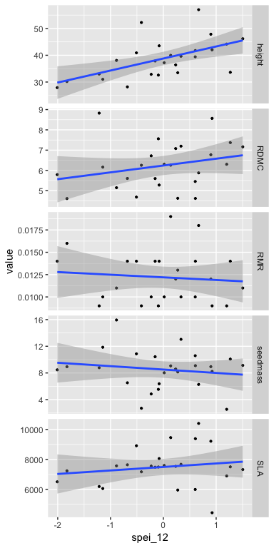
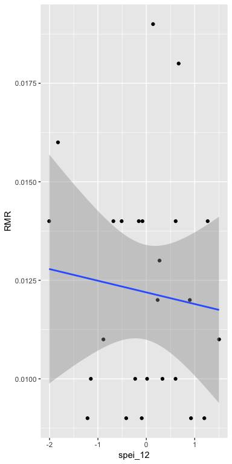
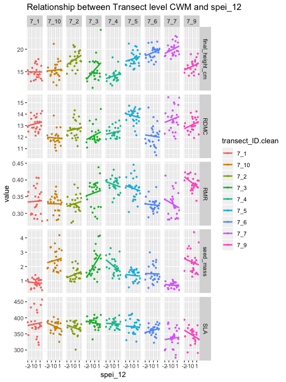
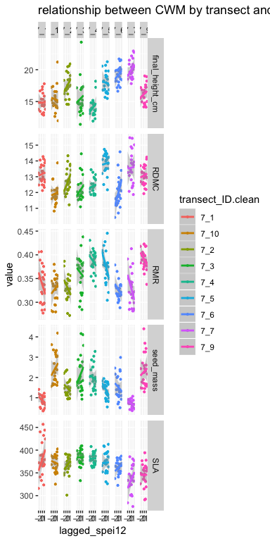
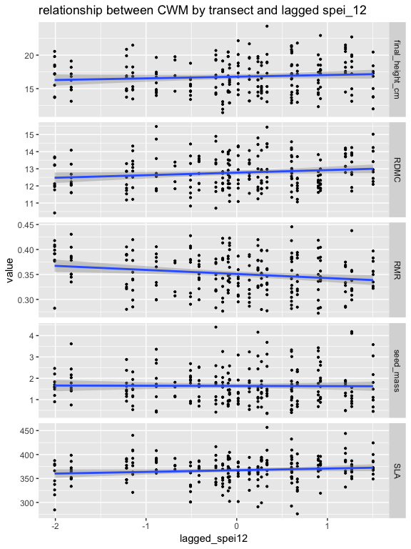

Kelman Preliminary Results
================
ek, jl, cw
Feb 25 2019

script purpose: feed in CWM and CWV outputs to create figures and models for analyses

SETUP

``` r
rm(list=ls()) # start with clean environment
options(stringsAsFactors = FALSE) #character variables never factor by default 
```

Load libraries

``` r
library(tidyverse) #tidyverse has ggplot2, no need to load separately


#set relative pathway to Google Drive --> user will need to adjust this <---
# **uncomment whichever path is yours when running script
gdrive <- "/Users/emilykelman/Google\ Drive" #emily's path
#gdrive <- "/Users/serahsierra/Google\ Drive" #ctw path
#gdrive <- "" #julie's path
```

read in data

``` r
CWV <- read.csv(paste0(gdrive, "/KelmanProject/Data/CWV_climate_merge.csv"))
tranCWM_regressions <- read.csv(paste0(gdrive, "/KelmanProject/Data/transectCWM_for_regressions.csv"))
tranCWM_figures <- read.csv(paste0(gdrive, "/KelmanProject/Data/transectCWM_for_figures.csv"))
poolCWM_regressions <- read.csv(paste0(gdrive, "/KelmanProject/Data/pooledCWM_for_figures.csv"))
poolCWM_figures <- read.csv(paste0(gdrive, "/KelmanProject/Data/pooledCWM_for_figures.csv"))
clim_dat <- read.csv(paste0(gdrive, "/KelmanProject/Data/boulder_climate.csv"))
```

issue: trying to figure out how to show spei\_12 on x-axis
==========================================================

``` r
# **solution: need to have climate data in their own column if want to use on the x-axis, so just merge climate data with long-form trait value
# ** it's okay that climate data are both in the trait_name column, and in their own column. 
# ** it's more columns in the data frame, but also makes the data frame flexible so you can plot however you like
tranCWM_figures <- left_join(tranCWM_figures, clim_dat, by = c("Year" = "year"))
```

create vector for spei\_lag and add to tranCWM\_regressions, tranCWM\_figures, & CWV

``` r
CWV <-CWV%>% 
  mutate(lagged_spei12=lag(spei_12))

tranCWM_figures <- tranCWM_figures%>%
  group_by(transect_ID.clean)%>%
   mutate(lagged_spei12=lag(spei_12))

tranCWM_regressions <-tranCWM_regressions%>%
  group_by(transect_ID.clean)%>%
  mutate(lagged_spei12=lag(spei_12))
```

create long form CWV DF for creating figures

``` r
CWV_figures <- CWV %>% gather("trait_name", value, 2:6)
```

=====create CWV figures (current and lagged)======

fig 1: variation in trait values (CWV) in relation to current spei\_12 (pooled data)

fig 2: variation in trait values (CWV) in relation to lagged spei\_12 (pooled data)

``` r
#plot fig 1: panel plot of CWV of traits and current spei_12
current_CWV_spei_panel<- ggplot(subset(CWV_figures, trait_name%in% c("height", "RMR", "SLA", "RDMC", "seedmass")), 
mapping = aes(x=spei_12, y=value))+
  geom_point(size = 0.75)+
  geom_smooth(method=lm)+
  facet_grid(trait_name~., scales = "free_y")

current_CWV_spei_panel
```



``` r
#plot fig 2: panel plot of CWV of traits and lagged spei_12
lag_CWV_spei_panel <- ggplot(subset(CWV_figures, trait_name%in% c("height", "RMR", "SLA", "RDMC", "seedmass")),
   mapping = aes(x=lagged_spei12, y=value))+
  geom_point(size = 0.75)+
  geom_smooth(method=lm)+
  facet_grid(trait_name~., scales = "free_y")
  
lag_CWV_spei_panel            
```

    ## Warning: Removed 5 rows containing non-finite values (stat_smooth).

    ## Warning: Removed 5 rows containing missing values (geom_point).


====exploratory CWV figures======

``` r
#plot CWV RMR and spei_12
CWV_RMR_spei_fig <- ggplot(CWV, mapping = aes(x=spei_12, y=RMR))+
  geom_point()+
  geom_smooth(method=lm)

CWV_RMR_spei_fig
```



====run linear regressions for CWV and traits (current)=====

``` r
#LM of CWV RMR and spei_12
#p value .6 and r^2 -.03
#not significant
current_CWV_RMR_spei_LM<- lm(formula = RMR ~ spei_12, data = CWV)
summary(current_CWV_RMR_spei_LM)
```

    ## 
    ## Call:
    ## lm(formula = RMR ~ spei_12, data = CWV)
    ## 
    ## Residuals:
    ##       Min        1Q    Median        3Q       Max 
    ## -0.003552 -0.002261 -0.000124  0.001761  0.006848 
    ## 
    ## Coefficients:
    ##               Estimate Std. Error t value Pr(>|t|)    
    ## (Intercept)  0.0121931  0.0005814  20.973   <2e-16 ***
    ## spei_12     -0.0002956  0.0006446  -0.459    0.651    
    ## ---
    ## Signif. codes:  0 '***' 0.001 '**' 0.01 '*' 0.05 '.' 0.1 ' ' 1
    ## 
    ## Residual standard error: 0.002906 on 23 degrees of freedom
    ## Multiple R-squared:  0.009063,   Adjusted R-squared:  -0.03402 
    ## F-statistic: 0.2104 on 1 and 23 DF,  p-value: 0.6508

``` r
#LM of CWV final height and spei_12
#p value .002 r^2 .2951
#significant!
current_CWV_height_spei_LM <- lm(formula = height ~ spei_12, data = CWV)
summary(current_CWV_height_spei_LM)
```

    ## 
    ## Call:
    ## lm(formula = height ~ spei_12, data = CWV)
    ## 
    ## Residuals:
    ##      Min       1Q   Median       3Q      Max 
    ## -10.8567  -2.6228  -0.4029   0.6412  15.3170 
    ## 
    ## Coefficients:
    ##             Estimate Std. Error t value Pr(>|t|)    
    ## (Intercept)   38.792      1.220  31.807  < 2e-16 ***
    ## spei_12        4.494      1.352   3.324  0.00296 ** 
    ## ---
    ## Signif. codes:  0 '***' 0.001 '**' 0.01 '*' 0.05 '.' 0.1 ' ' 1
    ## 
    ## Residual standard error: 6.096 on 23 degrees of freedom
    ## Multiple R-squared:  0.3245, Adjusted R-squared:  0.2951 
    ## F-statistic: 11.05 on 1 and 23 DF,  p-value: 0.002957

``` r
#LM CWV RDMC and spei_12
#p alue .19 r^2 .031
#not significant
current_CWV_RDMC_spei_LM <- lm(formula = RDMC ~ spei_12, data = CWV)
summary(current_CWV_RDMC_spei_LM)
```

    ## 
    ## Call:
    ## lm(formula = RDMC ~ spei_12, data = CWV)
    ## 
    ## Residuals:
    ##      Min       1Q   Median       3Q      Max 
    ## -1.82572 -0.79366  0.05523  0.55516  2.99287 
    ## 
    ## Coefficients:
    ##             Estimate Std. Error t value Pr(>|t|)    
    ## (Intercept)   6.2414     0.2284   27.32   <2e-16 ***
    ## spei_12       0.3368     0.2532    1.33    0.197    
    ## ---
    ## Signif. codes:  0 '***' 0.001 '**' 0.01 '*' 0.05 '.' 0.1 ' ' 1
    ## 
    ## Residual standard error: 1.142 on 23 degrees of freedom
    ## Multiple R-squared:  0.07141,    Adjusted R-squared:  0.03104 
    ## F-statistic: 1.769 on 1 and 23 DF,  p-value: 0.1966

``` r
#LM CWV seed mass and spei_12
#p value .449 r^2 -.017
#not significant
current_CWV_seedmass_spei_LM <- lm(formula = seedmass ~ spei_12, data = CWV)
summary(current_CWV_seedmass_spei_LM)
```

    ## 
    ## Call:
    ## lm(formula = seedmass ~ spei_12, data = CWV)
    ## 
    ## Residuals:
    ##     Min      1Q  Median      3Q     Max 
    ## -6.0179 -1.8908  0.1912  1.8418  6.9771 
    ## 
    ## Coefficients:
    ##             Estimate Std. Error t value Pr(>|t|)    
    ## (Intercept)   8.5112     0.5965   14.27 6.49e-13 ***
    ## spei_12      -0.5094     0.6614   -0.77    0.449    
    ## ---
    ## Signif. codes:  0 '***' 0.001 '**' 0.01 '*' 0.05 '.' 0.1 ' ' 1
    ## 
    ## Residual standard error: 2.982 on 23 degrees of freedom
    ## Multiple R-squared:  0.02514,    Adjusted R-squared:  -0.01724 
    ## F-statistic: 0.5933 on 1 and 23 DF,  p-value: 0.449

``` r
#LM CWV SLA and spei_12
#p value .42 r^2 -.014
current_CWV_SLA_spei_LM <- lm(formula = SLA ~ spei_12, data = CWV)
summary(current_CWV_SLA_spei_LM)
```

    ## 
    ## Call:
    ## lm(formula = SLA ~ spei_12, data = CWV)
    ## 
    ## Residuals:
    ##     Min      1Q  Median      3Q     Max 
    ## -3271.8  -522.9    23.7   303.7  2750.2 
    ## 
    ## Coefficients:
    ##             Estimate Std. Error t value Pr(>|t|)    
    ## (Intercept)   7497.8      261.7  28.647   <2e-16 ***
    ## spei_12        233.6      290.2   0.805    0.429    
    ## ---
    ## Signif. codes:  0 '***' 0.001 '**' 0.01 '*' 0.05 '.' 0.1 ' ' 1
    ## 
    ## Residual standard error: 1308 on 23 degrees of freedom
    ## Multiple R-squared:  0.0274, Adjusted R-squared:  -0.01489 
    ## F-statistic: 0.6479 on 1 and 23 DF,  p-value: 0.4291

====run linear regressions for CWV and traits (lagged)=====

``` r
#LM of CWV RMR and lagged spei
#p value .02 r^2 .1624
#significant! 
lag_CWV_RMR_spei_LM <- lm(formula = RMR ~ lagged_spei12, data = CWV)
summary(lag_CWV_RMR_spei_LM)
```

    ## 
    ## Call:
    ## lm(formula = RMR ~ lagged_spei12, data = CWV)
    ## 
    ## Residuals:
    ##        Min         1Q     Median         3Q        Max 
    ## -0.0042164 -0.0018309 -0.0004392  0.0020520  0.0060182 
    ## 
    ## Coefficients:
    ##                 Estimate Std. Error t value Pr(>|t|)    
    ## (Intercept)    0.0122823  0.0005383  22.817   <2e-16 ***
    ## lagged_spei12 -0.0013722  0.0005873  -2.337    0.029 *  
    ## ---
    ## Signif. codes:  0 '***' 0.001 '**' 0.01 '*' 0.05 '.' 0.1 ' ' 1
    ## 
    ## Residual standard error: 0.002637 on 22 degrees of freedom
    ##   (1 observation deleted due to missingness)
    ## Multiple R-squared:  0.1988, Adjusted R-squared:  0.1624 
    ## F-statistic: 5.459 on 1 and 22 DF,  p-value: 0.02897

``` r
#LM of CWV final height and lagged spei
#p value .89 r^2 -.044
#not significant
lag_CWV_height_spei_LM <- lm(formula = height ~ lagged_spei12, data = CWV)
summary(lag_CWV_height_spei_LM)
```

    ## 
    ## Call:
    ## lm(formula = height ~ lagged_spei12, data = CWV)
    ## 
    ## Residuals:
    ##      Min       1Q   Median       3Q      Max 
    ## -10.9013  -5.8633  -0.0114   3.4084  18.7203 
    ## 
    ## Coefficients:
    ##               Estimate Std. Error t value Pr(>|t|)    
    ## (Intercept)    38.7508     1.5460  25.065   <2e-16 ***
    ## lagged_spei12   0.2181     1.6866   0.129    0.898    
    ## ---
    ## Signif. codes:  0 '***' 0.001 '**' 0.01 '*' 0.05 '.' 0.1 ' ' 1
    ## 
    ## Residual standard error: 7.574 on 22 degrees of freedom
    ##   (1 observation deleted due to missingness)
    ## Multiple R-squared:  0.0007597,  Adjusted R-squared:  -0.04466 
    ## F-statistic: 0.01673 on 1 and 22 DF,  p-value: 0.8983

``` r
#LM of CWV RDMC and lagged spei
#p value .15 r^2 .04
#not significant
lag_CWV_RDMC_spei_LM <- lm(formula = RDMC ~ lagged_spei12, data = CWV)
summary(lag_CWV_RDMC_spei_LM)
```

    ## 
    ## Call:
    ## lm(formula = RDMC ~ lagged_spei12, data = CWV)
    ## 
    ## Residuals:
    ##     Min      1Q  Median      3Q     Max 
    ## -1.8672 -1.1338  0.2425  0.5916  2.3623 
    ## 
    ## Coefficients:
    ##               Estimate Std. Error t value Pr(>|t|)    
    ## (Intercept)     6.2333     0.2359  26.428   <2e-16 ***
    ## lagged_spei12   0.3800     0.2573   1.477    0.154    
    ## ---
    ## Signif. codes:  0 '***' 0.001 '**' 0.01 '*' 0.05 '.' 0.1 ' ' 1
    ## 
    ## Residual standard error: 1.155 on 22 degrees of freedom
    ##   (1 observation deleted due to missingness)
    ## Multiple R-squared:  0.09018,    Adjusted R-squared:  0.04883 
    ## F-statistic: 2.181 on 1 and 22 DF,  p-value: 0.1539

``` r
#LM of CWV seedmass and lagged spei
#p value .73 r^2 -.04
#not significant
lag_CWV_seedmass_spei_LM <-lm(formula = seedmass ~ lagged_spei12, data = CWV)
summary(lag_CWV_seedmass_spei_LM)
```

    ## 
    ## Call:
    ## lm(formula = seedmass ~ lagged_spei12, data = CWV)
    ## 
    ## Residuals:
    ##     Min      1Q  Median      3Q     Max 
    ## -6.1168 -1.7664  0.2346  1.5664  7.1873 
    ## 
    ## Coefficients:
    ##               Estimate Std. Error t value Pr(>|t|)    
    ## (Intercept)     8.5452     0.6283  13.601 3.46e-12 ***
    ## lagged_spei12   0.2307     0.6854   0.337     0.74    
    ## ---
    ## Signif. codes:  0 '***' 0.001 '**' 0.01 '*' 0.05 '.' 0.1 ' ' 1
    ## 
    ## Residual standard error: 3.078 on 22 degrees of freedom
    ##   (1 observation deleted due to missingness)
    ## Multiple R-squared:  0.005125,   Adjusted R-squared:  -0.0401 
    ## F-statistic: 0.1133 on 1 and 22 DF,  p-value: 0.7396

``` r
#LM of CWV SLA and lagged spei
#p value .159 r^2 .04
#not significant
lag_CWV_SLA_spei_LM <- lm(formula = SLA ~ lagged_spei12, data = CWV)
summary(lag_CWV_SLA_spei_LM)
```

    ## 
    ## Call:
    ## lm(formula = SLA ~ lagged_spei12, data = CWV)
    ## 
    ## Residuals:
    ##      Min       1Q   Median       3Q      Max 
    ## -2511.28  -864.76    24.63   721.13  2182.35 
    ## 
    ## Coefficients:
    ##               Estimate Std. Error t value Pr(>|t|)    
    ## (Intercept)     7485.2      264.4  28.310   <2e-16 ***
    ## lagged_spei12   -419.8      288.4  -1.455     0.16    
    ## ---
    ## Signif. codes:  0 '***' 0.001 '**' 0.01 '*' 0.05 '.' 0.1 ' ' 1
    ## 
    ## Residual standard error: 1295 on 22 degrees of freedom
    ##   (1 observation deleted due to missingness)
    ## Multiple R-squared:  0.08781,    Adjusted R-squared:  0.04634 
    ## F-statistic: 2.118 on 1 and 22 DF,  p-value: 0.1597

=====create CWM figures=====

panel plot of CWMs, spei\_12 on x, trait on y

transect level

fig 3: current spei\_12

fig 4: lagged spei\_12

``` r
#plot fig 3: panel plot of CWM traits at transect level with current spei_12 on x. shows overall trend
current_tranCWM_spei_panel <- ggplot(subset(tranCWM_figures, trait_name%in% c("final_height_cm", "RMR", "SLA", "RDMC", "seed_mass")), 
                                     mapping = aes( x=spei_12, y=value))+
  geom_point(size = 0.75)+
  geom_smooth(method=lm, se=FALSE)+
  facet_grid(trait_name~., scales = "free_y")+
  ggtitle("Relationship between Transect level CWM and spei_12")

current_tranCWM_spei_panel
```


``` r
#plot CWM traits and current spei_12. Shows changes in mean value across transects
current_tranCWM_spei_panel <- ggplot(subset(tranCWM_figures, trait_name%in% c("final_height_cm", "RMR", "SLA", "RDMC", "seed_mass")), 
               mapping = aes(col = transect_ID.clean, x=spei_12, y=value))+
  geom_point(aes(col = transect_ID.clean), size = 0.75)+
  geom_smooth(method=lm, se=FALSE)+
  facet_grid(trait_name~transect_ID.clean, scales = "free_y")+
  ggtitle("Relationship between Transect level CWM and spei_12")

current_tranCWM_spei_panel
```



plot fig 4: panel plot of CWM traits at transect level with lagged spei\_12 on x. shows different transects explicitly

``` r
lagged_tranCWM_spei_panel<- ggplot(subset(tranCWM_figures, trait_name%in% c("final_height_cm", "RMR", "SLA", "RDMC", "seed_mass")), 
                                    mapping = aes(col=transect_ID.clean, x=lagged_spei12, y=value))+
  geom_point( size = 0.75)+
  geom_smooth(method=lm)+
  facet_grid(trait_name~transect_ID.clean, scales = "free_y")+
  ggtitle("relationship between CWM by transect and lagged spei_12")

lagged_tranCWM_spei_panel
```

    ## Warning: Removed 9 rows containing non-finite values (stat_smooth).

    ## Warning: Removed 9 rows containing missing values (geom_point).



``` r
#panel plot CWM traits and lagged spei_12 across transects to observe global trends
lagged_tranCWM_spei_panel_global <- ggplot(subset(tranCWM_figures, trait_name%in% c("final_height_cm", "RMR", "SLA", "RDMC", "seed_mass")), 
                                    mapping = aes( x=lagged_spei12, y=value))+
  geom_point( size = 0.75)+
  geom_smooth(method=lm)+
  facet_grid(trait_name~., scales = "free_y")+
  ggtitle("relationship between CWM by transect and lagged spei_12")

lagged_tranCWM_spei_panel_global
```

    ## Warning: Removed 9 rows containing non-finite values (stat_smooth).

    ## Warning: Removed 9 rows containing missing values (geom_point).



====run linear regressions for CWM traits and spei\_12 (current)=====

``` r
#LM for CWM RMR and spei
#p value .5 r^2 -.002
#not significant
current_tranCWM_RMR_spei_LM <- lm(formula = RMR ~ spei_12*transect_ID.clean, data = tranCWM_regressions)
summary(current_tranCWM_RMR_spei_LM)
```

    ## 
    ## Call:
    ## lm(formula = RMR ~ spei_12 * transect_ID.clean, data = tranCWM_regressions)
    ## 
    ## Residuals:
    ##       Min        1Q    Median        3Q       Max 
    ## -0.080148 -0.018114  0.002214  0.018922  0.072016 
    ## 
    ## Coefficients:
    ##                                Estimate Std. Error t value Pr(>|t|)    
    ## (Intercept)                    0.336329   0.006340  53.049  < 2e-16 ***
    ## spei_12                        0.001120   0.006967   0.161  0.87240    
    ## transect_ID.clean7_10         -0.007532   0.008966  -0.840  0.40187    
    ## transect_ID.clean7_2          -0.006874   0.008877  -0.774  0.43967    
    ## transect_ID.clean7_3           0.025604   0.008877   2.884  0.00435 ** 
    ## transect_ID.clean7_4           0.049377   0.008966   5.507 1.10e-07 ***
    ## transect_ID.clean7_5           0.037910   0.008877   4.270 3.00e-05 ***
    ## transect_ID.clean7_6          -0.010891   0.008877  -1.227  0.22133    
    ## transect_ID.clean7_7          -0.008842   0.008966  -0.986  0.32524    
    ## transect_ID.clean7_9           0.053946   0.008966   6.017 8.24e-09 ***
    ## spei_12:transect_ID.clean7_10 -0.001456   0.009853  -0.148  0.88265    
    ## spei_12:transect_ID.clean7_2   0.002995   0.009798   0.306  0.76017    
    ## spei_12:transect_ID.clean7_3   0.003428   0.009798   0.350  0.72683    
    ## spei_12:transect_ID.clean7_4  -0.005572   0.009853  -0.566  0.57234    
    ## spei_12:transect_ID.clean7_5  -0.005665   0.009798  -0.578  0.56381    
    ## spei_12:transect_ID.clean7_6  -0.002717   0.009798  -0.277  0.78185    
    ## spei_12:transect_ID.clean7_7  -0.008505   0.009853  -0.863  0.38902    
    ## spei_12:transect_ID.clean7_9  -0.010657   0.009853  -1.082  0.28069    
    ## ---
    ## Signif. codes:  0 '***' 0.001 '**' 0.01 '*' 0.05 '.' 0.1 ' ' 1
    ## 
    ## Residual standard error: 0.03106 on 202 degrees of freedom
    ## Multiple R-squared:  0.427,  Adjusted R-squared:  0.3788 
    ## F-statistic: 8.855 on 17 and 202 DF,  p-value: < 2.2e-16

``` r
current_tranCWM_RMR_spei_LM2 <- lm(formula = RMR ~ spei_12+transect_ID.clean, data = tranCWM_regressions)
current_tranCWM_RMR_spei_LM3 <- lm(formula = RMR ~ spei_12, data = tranCWM_regressions)

anova(current_tranCWM_RMR_spei_LM, current_tranCWM_RMR_spei_LM2)
```

    ## Analysis of Variance Table
    ## 
    ## Model 1: RMR ~ spei_12 * transect_ID.clean
    ## Model 2: RMR ~ spei_12 + transect_ID.clean
    ##   Res.Df     RSS Df  Sum of Sq      F Pr(>F)
    ## 1    202 0.19486                            
    ## 2    210 0.19870 -8 -0.0038397 0.4975 0.8571

``` r
#LM for CWM height and spei_12
#p value .037 r^2 .015
#significant!
current_tranCWM_height_spei_LM <- lm(formula = final_height_cm ~ spei_12, data = tranCWM_regressions)
summary(current_tranCWM_height_spei_LM)
```

    ## 
    ## Call:
    ## lm(formula = final_height_cm ~ spei_12, data = tranCWM_regressions)
    ## 
    ## Residuals:
    ##     Min      1Q  Median      3Q     Max 
    ## -5.1707 -2.0835  0.0413  1.9340  6.9291 
    ## 
    ## Coefficients:
    ##             Estimate Std. Error t value Pr(>|t|)    
    ## (Intercept)  16.7952     0.1711  98.176   <2e-16 ***
    ## spei_12       0.3944     0.1887   2.089   0.0378 *  
    ## ---
    ## Signif. codes:  0 '***' 0.001 '**' 0.01 '*' 0.05 '.' 0.1 ' ' 1
    ## 
    ## Residual standard error: 2.537 on 218 degrees of freedom
    ## Multiple R-squared:  0.01963,    Adjusted R-squared:  0.01514 
    ## F-statistic: 4.366 on 1 and 218 DF,  p-value: 0.03783

``` r
#LM for CWM RDMC and spei_12
#p vaule .35 r^2 -.0006
#not significant
current_tranCWM_RDMC_spei_LM <- lm(formula = RDMC ~ spei_12, data = tranCWM_regressions)
summary(current_tranCWM_RDMC_spei_LM)
```

    ## 
    ## Call:
    ## lm(formula = RDMC ~ spei_12, data = tranCWM_regressions)
    ## 
    ## Residuals:
    ##     Min      1Q  Median      3Q     Max 
    ## -2.3979 -0.7465 -0.1114  0.7243  2.7754 
    ## 
    ## Coefficients:
    ##             Estimate Std. Error t value Pr(>|t|)    
    ## (Intercept) 12.77403    0.06590 193.842   <2e-16 ***
    ## spei_12      0.06775    0.07271   0.932    0.352    
    ## ---
    ## Signif. codes:  0 '***' 0.001 '**' 0.01 '*' 0.05 '.' 0.1 ' ' 1
    ## 
    ## Residual standard error: 0.9774 on 218 degrees of freedom
    ## Multiple R-squared:  0.003967,   Adjusted R-squared:  -0.0006018 
    ## F-statistic: 0.8683 on 1 and 218 DF,  p-value: 0.3525

``` r
#LM for CWM seedmass and spei_12
#p value .66 r^2 -.003
#not significant
current_tranCWM_seedmass_spei_LM <-lm(formula = seed_mass ~ spei_12, data = tranCWM_regressions)
summary(current_tranCWM_seedmass_spei_LM)
```

    ## 
    ## Call:
    ## lm(formula = seed_mass ~ spei_12, data = tranCWM_regressions)
    ## 
    ## Residuals:
    ##     Min      1Q  Median      3Q     Max 
    ## -1.3340 -0.6081 -0.1140  0.3876  2.7477 
    ## 
    ## Coefficients:
    ##             Estimate Std. Error t value Pr(>|t|)    
    ## (Intercept)  1.64226    0.05577  29.447   <2e-16 ***
    ## spei_12      0.02681    0.06153   0.436    0.664    
    ## ---
    ## Signif. codes:  0 '***' 0.001 '**' 0.01 '*' 0.05 '.' 0.1 ' ' 1
    ## 
    ## Residual standard error: 0.8272 on 218 degrees of freedom
    ## Multiple R-squared:  0.0008699,  Adjusted R-squared:  -0.003713 
    ## F-statistic: 0.1898 on 1 and 218 DF,  p-value: 0.6635

``` r
#LM for CWM Sla and spei_12
# pvalue .43 r^2 -.0017
#not significant
current_tranCWM_SLA_spei_LM <- lm(formula = SLA ~spei_12, data = tranCWM_regressions)
summary(current_tranCWM_SLA_spei_LM)
```

    ## 
    ## Call:
    ## lm(formula = SLA ~ spei_12, data = tranCWM_regressions)
    ## 
    ## Residuals:
    ##     Min      1Q  Median      3Q     Max 
    ## -90.004 -16.263   3.094  17.899  91.949 
    ## 
    ## Coefficients:
    ##             Estimate Std. Error t value Pr(>|t|)    
    ## (Intercept)  367.193      1.874 195.897   <2e-16 ***
    ## spei_12       -1.628      2.068  -0.787    0.432    
    ## ---
    ## Signif. codes:  0 '***' 0.001 '**' 0.01 '*' 0.05 '.' 0.1 ' ' 1
    ## 
    ## Residual standard error: 27.8 on 218 degrees of freedom
    ## Multiple R-squared:  0.002833,   Adjusted R-squared:  -0.001741 
    ## F-statistic: 0.6194 on 1 and 218 DF,  p-value: 0.4321

====run linear regressions for CWM traits and spei\_12 (lagged)=====

``` r
#LM of CWM height and lagged spei_12
#pvalue .2 r^2 .002
#not significant
lagged_CWM_height_spei_LM <-lm(formula = final_height_cm ~ lagged_spei12, data = tranCWM_regressions)
summary(lagged_CWM_height_spei_LM)
```

    ## 
    ## Call:
    ## lm(formula = final_height_cm ~ lagged_spei12, data = tranCWM_regressions)
    ## 
    ## Residuals:
    ##     Min      1Q  Median      3Q     Max 
    ## -5.3220 -2.1244  0.1323  1.9155  7.4505 
    ## 
    ## Coefficients:
    ##               Estimate Std. Error t value Pr(>|t|)    
    ## (Intercept)    16.7840     0.1764  95.151   <2e-16 ***
    ## lagged_spei12   0.2484     0.1914   1.297    0.196    
    ## ---
    ## Signif. codes:  0 '***' 0.001 '**' 0.01 '*' 0.05 '.' 0.1 ' ' 1
    ## 
    ## Residual standard error: 2.562 on 209 degrees of freedom
    ##   (9 observations deleted due to missingness)
    ## Multiple R-squared:  0.00799,    Adjusted R-squared:  0.003244 
    ## F-statistic: 1.683 on 1 and 209 DF,  p-value: 0.1959

``` r
#LM of CWM RMR and lagged spei_12
#pvalue .004 r^2 .03144
#significant!
lagged_CWM_RMR_spei_LM <- lm(formula = RMR ~ lagged_spei12, data = tranCWM_regressions)
summary(lagged_CWM_RMR_spei_LM)
```

    ## 
    ## Call:
    ## lm(formula = RMR ~ lagged_spei12, data = tranCWM_regressions)
    ## 
    ## Residuals:
    ##       Min        1Q    Median        3Q       Max 
    ## -0.085285 -0.030095 -0.002255  0.029354  0.099398 
    ## 
    ## Coefficients:
    ##                Estimate Std. Error t value Pr(>|t|)    
    ## (Intercept)    0.351087   0.002701 130.001  < 2e-16 ***
    ## lagged_spei12 -0.008214   0.002931  -2.803  0.00554 ** 
    ## ---
    ## Signif. codes:  0 '***' 0.001 '**' 0.01 '*' 0.05 '.' 0.1 ' ' 1
    ## 
    ## Residual standard error: 0.03923 on 209 degrees of freedom
    ##   (9 observations deleted due to missingness)
    ## Multiple R-squared:  0.03623,    Adjusted R-squared:  0.03162 
    ## F-statistic: 7.856 on 1 and 209 DF,  p-value: 0.005542

``` r
#LM of CWM RDMC and lagged spei_12
#pvalue .04 r^2 .0146
#significant
lagged_CWM_RDMC_spei_LM <-lm(formula=RDMC ~ lagged_spei12, data = tranCWM_regressions)
summary(lagged_CWM_RDMC_spei_LM)
```

    ## 
    ## Call:
    ## lm(formula = RDMC ~ lagged_spei12, data = tranCWM_regressions)
    ## 
    ## Residuals:
    ##     Min      1Q  Median      3Q     Max 
    ## -2.0346 -0.7706 -0.1212  0.7623  2.8432 
    ## 
    ## Coefficients:
    ##               Estimate Std. Error t value Pr(>|t|)    
    ## (Intercept)   12.76505    0.06735 189.532   <2e-16 ***
    ## lagged_spei12  0.15388    0.07309   2.105   0.0364 *  
    ## ---
    ## Signif. codes:  0 '***' 0.001 '**' 0.01 '*' 0.05 '.' 0.1 ' ' 1
    ## 
    ## Residual standard error: 0.9783 on 209 degrees of freedom
    ##   (9 observations deleted due to missingness)
    ## Multiple R-squared:  0.02077,    Adjusted R-squared:  0.01608 
    ## F-statistic: 4.433 on 1 and 209 DF,  p-value: 0.03644

``` r
#plot(tranCWM_regressions$lagged_spei12,tranCWM_regressions$RDMC)

#LM of CWM seedmass and lagged spei_12
#pvalue .86 r^2 -.004
#not significant
lagged_CWM_seedmass_spei_LM<-lm(formula = seed_mass ~ lagged_spei12, data = tranCWM_regressions)
summary(lagged_CWM_seedmass_spei_LM)
```

    ## 
    ## Call:
    ## lm(formula = seed_mass ~ lagged_spei12, data = tranCWM_regressions)
    ## 
    ## Residuals:
    ##     Min      1Q  Median      3Q     Max 
    ## -1.2938 -0.5824 -0.1114  0.3709  2.7504 
    ## 
    ## Coefficients:
    ##               Estimate Std. Error t value Pr(>|t|)    
    ## (Intercept)    1.64599    0.05745  28.652   <2e-16 ***
    ## lagged_spei12 -0.01098    0.06234  -0.176     0.86    
    ## ---
    ## Signif. codes:  0 '***' 0.001 '**' 0.01 '*' 0.05 '.' 0.1 ' ' 1
    ## 
    ## Residual standard error: 0.8344 on 209 degrees of freedom
    ##   (9 observations deleted due to missingness)
    ## Multiple R-squared:  0.0001484,  Adjusted R-squared:  -0.004636 
    ## F-statistic: 0.03102 on 1 and 209 DF,  p-value: 0.8604

``` r
#LM of CWM SLA and lagged spei_12
#pvalue .08 r^2 .008
#not significant
lagged_CWM_SLA_spei_LM <-lm(formula = SLA ~ lagged_spei12, data = tranCWM_regressions)
summary(lagged_CWM_SLA_spei_LM)
```

    ## 
    ## Call:
    ## lm(formula = SLA ~ lagged_spei12, data = tranCWM_regressions)
    ## 
    ## Residuals:
    ##     Min      1Q  Median      3Q     Max 
    ## -93.257 -15.209   2.815  18.016  88.437 
    ## 
    ## Coefficients:
    ##               Estimate Std. Error t value Pr(>|t|)    
    ## (Intercept)    367.057      1.935 189.701   <2e-16 ***
    ## lagged_spei12    3.593      2.100   1.711   0.0885 .  
    ## ---
    ## Signif. codes:  0 '***' 0.001 '**' 0.01 '*' 0.05 '.' 0.1 ' ' 1
    ## 
    ## Residual standard error: 28.11 on 209 degrees of freedom
    ##   (9 observations deleted due to missingness)
    ## Multiple R-squared:  0.01382,    Adjusted R-squared:  0.009101 
    ## F-statistic: 2.929 on 1 and 209 DF,  p-value: 0.08849

``` r
# # -- COMPILE ALL LM RESULTS -----
# # 1) create vector of linear model objects in your global environment
# # list all objects in your global environment
# env_objects <- ls()
# # grab the objects that are linear models
# ## this line iterates over env_objects and tests whether it is an lm objects or not, it returns TRUE or FALSE
# # lms_only <- unlist(sapply(env_objects, function(x) class(get(x)) == "lm"))
# # ## this line subsets the env_objects vector to keep only the positions where lms_only == TRUE
# # ## i.e. it pulls out the names of lm objects only
# # lm_objects <- env_objects[lms_only]
# lm_objects <- env_objects[grepl("_LM", env_objects)]
# 
# # 2) # initiate empty data frames for lm results
# # to store overall model results
# model_df <- data.frame()
# # to store coefficient results
# coeff_df <- data.frame()
# 
# # 3) use a for-loop to grab model results in all models generated
# # a for-loop will run the code in between the curly brackets for every object in your lm_objects, one at a time
# for(o in 1:length(lm_objects)){
#   # isolate the lm of interest, store in  temporary model object
#   temp.lm  <- get(lm_objects[o])
#   model_call <- as.character((summary(temp.lm)[[1]]))
#   dataset = model_call[3]
#   model = model_call[2]
#   terms <- names(temp.lm$coefficients)
#   # iterate through each term in the linear model and grab results
#   for(t in 1:length(terms)){
#     # this inner-for loop grabs model results for individual terms
#     coeff.name = terms[t]
#     coeff.value = temp.lm$coefficients[[t]]
#     CI.lower.bound = confint(temp.lm)[t]
#     CI.upper.bound = confint(temp.lm)[t+2]
#     coeff.pval = summary(temp.lm)[[4]][colnames(summary(temp.lm)[[4]]) == "Pr(>|t|)"][t]
#     # compile coefficient term results data frame, adding in results for term isolated at top of inner-for loop
#     coeff_df <- rbind(coeff_df,
#                       data.frame(cbind(dataset, model, coeff.name, coeff.value, coeff.pval, CI.upper.bound, CI.lower.bound)))
# 
#   }
#   # number of observations used in model (i.e. sample size)
#   n = nrow(temp.lm$model)
#   # overall model p-value
#   model.pval = anova(temp.lm)$`Pr(>F)`[1]
#   # model adjusted r-squared
#   adj.r2 = summary(temp.lm)$adj.r.squared
#   # compile overall model results data frame, adding in results for model isolated at top of for loop
#   model_df <- rbind(model_df,
#                     data.frame(cbind(dataset, model, n, model.pval, adj.r2)))
# }
# 
# # 4) compile everything in a master results data frame
# ## overall model values will repeat with each coefficient term (because those terms are from the same model)
# master_lm_results <- merge(model_df, coeff_df)
# 
# 
# 
# 
# 
```
