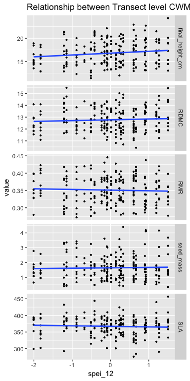

Kelman Preliminary Results
================
ek, jl, cw
Feb 25 2019

script purpose: feed in CWM and CWV outputs to create figures and models for analyses

SETUP

``` r
rm(list=ls()) # start with clean environment
options(stringsAsFactors = FALSE) #character variables never factor by default 
```

Load libraries

``` r
library(tidyverse) #tidyverse has ggplot2, no need to load separately


#set relative pathway to Google Drive --> user will need to adjust this <---
# **uncomment whichever path is yours when running script
gdrive <- "/Users/emilykelman/Google\ Drive" #emily's path
#gdrive <- "/Users/serahsierra/Google\ Drive" #ctw path
#gdrive <- "" #julie's path
```

read in data

``` r
CWV <- read.csv(paste0(gdrive, "/KelmanProject/Data/CWV_climate_merge.csv"))
tranCWM_regressions <- read.csv(paste0(gdrive, "/KelmanProject/Data/transectCWM_for_regressions.csv"))
tranCWM_figures <- read.csv(paste0(gdrive, "/KelmanProject/Data/transectCWM_for_figures.csv"))
poolCWM_regressions <- read.csv(paste0(gdrive, "/KelmanProject/Data/pooledCWM_for_figures.csv"))
poolCWM_figures <- read.csv(paste0(gdrive, "/KelmanProject/Data/pooledCWM_for_figures.csv"))
clim_dat <- read.csv(paste0(gdrive, "/KelmanProject/Data/boulder_climate.csv"))
```

add lagged spei\_12 to tranCWM\_figures DF & CWV DF

create vector

``` r
CWV$spei_lag <- lag(CWV$spei_12, k=1)
```

add to DF

``` r
tranCWM_figures$lagged_spei12 <- CWV$spei_lag
CWV$lagged_spei12 <- CWV$spei_lag
```

=====create CWV figures and run linear regressions (current)======

run lm

fig 1: variation in trait values (CWV) in relation to current spei\_12 (pooled data)

fig 2: variation in trait values (CWV) in relation to lagged spei\_12 (pooled data)

``` r
#plot fig 1: panel plot of CWV of traits and current spei_12
```

``` r
#need to re organize or create CWV for figures DF to put traits in same column 
```

====exploratory CWV figures======

``` r
#plot CWV RMR and spei_12
CWV_RMR_spei_fig <- ggplot(CWV, mapping = aes(x=spei_12, y=RMR))+
  geom_point()+
  geom_smooth()

CWV_RMR_spei_fig
```

    ## `geom_smooth()` using method = 'loess' and formula 'y ~ x'


``` r
#run linear regression for CWV RMR and spei_12
#p value .6 and r^2 -.03
#not significant
CWV_RMR_spei_LM<- lm(formula = RMR ~ spei_12, data = CWV)
summary(CWV_RMR_spei_LM)
```

    ## 
    ## Call:
    ## lm(formula = RMR ~ spei_12, data = CWV)
    ## 
    ## Residuals:
    ##       Min        1Q    Median        3Q       Max 
    ## -0.003552 -0.002261 -0.000124  0.001761  0.006848 
    ## 
    ## Coefficients:
    ##               Estimate Std. Error t value Pr(>|t|)    
    ## (Intercept)  0.0121931  0.0005814  20.973   <2e-16 ***
    ## spei_12     -0.0002956  0.0006446  -0.459    0.651    
    ## ---
    ## Signif. codes:  0 '***' 0.001 '**' 0.01 '*' 0.05 '.' 0.1 ' ' 1
    ## 
    ## Residual standard error: 0.002906 on 23 degrees of freedom
    ## Multiple R-squared:  0.009063,   Adjusted R-squared:  -0.03402 
    ## F-statistic: 0.2104 on 1 and 23 DF,  p-value: 0.6508

=====create CWM figures=====

panel plot of CWMs, spei\_12 on x, trait on y

transect level

fig 3: current spei\_12

fig 4: lagged spei\_12

``` r
#issue: trying to figure out how to show spei_12 on x-axis 
# **solution: need to have climate data in their own column if want to use on the x-axis, so just merge climate data with long-form trait value
# ** it's okay that climate data are both in the trait_name column, and in their own column. 
# ** it's more columns in the data frame, but also makes the data frame flexible so you can plot however you like
tranCWM_figures <- left_join(tranCWM_figures, clim_dat, by = c("Year" = "year"))

#plot fig 3: panel plot of CWM traits at transect level with current spei_12 on x
current_tranCWM_spei_panel <- ggplot(subset(tranCWM_figures, trait_name%in% c("final_height_cm", "RMR", "SLA", "RDMC", "seed_mass")), 
               mapping = aes(x=spei_12, y=value))+
  geom_point(aes(col = transect_ID.clean), size = 0.75)+
  geom_smooth()+
  facet_grid(trait_name~., scales = "free_y")

current_tranCWM_spei_panel
```

    ## `geom_smooth()` using method = 'loess' and formula 'y ~ x'



run linear regression with multiple trait variables (current)

pvalue .57 r^2 -.003

``` r
current_tranCWM_spei_LM <- lm(formula = SLA + final_height_cm + seed_mass + RDMC + RMR ~ spei_12, data=tranCWM_regressions)
summary(current_tranCWM_spei_LM)
```

    ## 
    ## Call:
    ## lm(formula = SLA + final_height_cm + seed_mass + RDMC + RMR ~ 
    ##     spei_12, data = tranCWM_regressions)
    ## 
    ## Residuals:
    ##     Min      1Q  Median      3Q     Max 
    ## -86.659 -14.169   3.514  17.031  87.590 
    ## 
    ## Coefficients:
    ##             Estimate Std. Error t value Pr(>|t|)    
    ## (Intercept)  398.755      1.844 216.289   <2e-16 ***
    ## spei_12       -1.141      2.034  -0.561    0.576    
    ## ---
    ## Signif. codes:  0 '***' 0.001 '**' 0.01 '*' 0.05 '.' 0.1 ' ' 1
    ## 
    ## Residual standard error: 27.34 on 218 degrees of freedom
    ## Multiple R-squared:  0.00144,    Adjusted R-squared:  -0.00314 
    ## F-statistic: 0.3144 on 1 and 218 DF,  p-value: 0.5756

plot fig 4: panel plot of CWM traits at transect level with lagged spei\_12 on x

``` r
lagged_tranCWM_spei_panel <- ggplot(subset(tranCWM_figures, trait_name%in% c("final_height_cm", "RMR", "SLA", "RDMC", "seed_mass")), 
                                    mapping = aes(x=lagged_spei12, y=value))+
  geom_point(aes(col = transect_ID.clean), size = 0.75)+
  geom_smooth()+
  facet_grid(trait_name~., scales = "free_y")

lagged_tranCWM_spei_panel
```

    ## `geom_smooth()` using method = 'loess' and formula 'y ~ x'

    ## Warning: Removed 45 rows containing non-finite values (stat_smooth).

    ## Warning: Removed 45 rows containing missing values (geom_point).


run linear regression with multiple trait variables (lagged)

``` r
#need to add lagged spei_12 to the tranCWM regressions DF 
```

``` r
#lagged_tranCWM_spei_LM <- lm(formula = SLA + final_height_cm + seed_mass + RDMC + RMR ~ lagged_spei12, data=tranCWM_regressions)
#summary(lagged_tranCWM_spei_LM)
```
